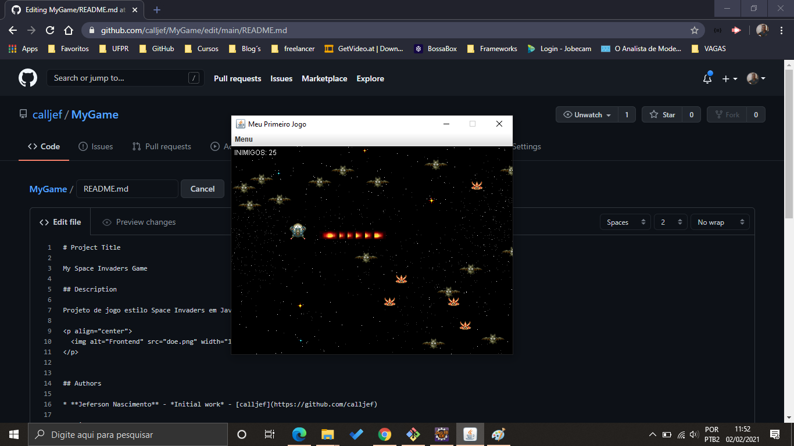

# Project Title

My Space Invaders Game

## Description

Projeto de jogo estilo Space Invaders em Java apresentado na materia de Testabilidade de software e POO

  

## Authors

* **Jeferson Nascimento** - *Initial work* - [calljef](https://github.com/calljef)

## License

Esse projeto está sob a licença MIT. Veja o arquivo [LICENSE](LICENSE.md) para mais detalhes.

## Acknowledgments

* Dep. Engenharia Elétrica UFPR(http://www.eletrica.ufpr.br/p/Inicio)
